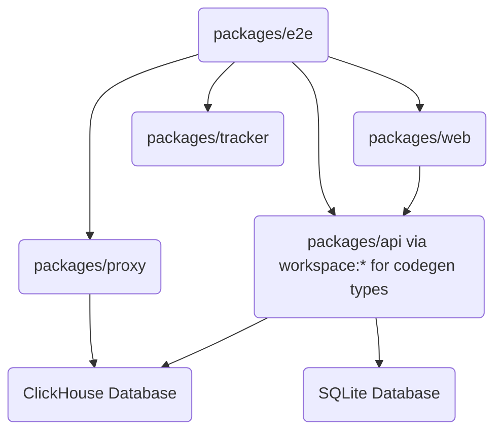

# File: .ai/skill/ARCHITECTURE.md

## 1. Repository Overview

LightScope CE (Community Edition) is a high-performance web analytics platform powered by ClickHouse. The project is built as a TypeScript monorepo using **pnpm workspaces**. It provides real-time data aggregation and a modern dashboard.

**Evidence:**
- `package.json` (`"name": "lightscope-ce"`)
- `pnpm-workspace.yaml` (`packages:\n  - packages/*`)

## 2. Technology Stack

- **Workspace Manager:** pnpm workspaces (Evidence: `pnpm-workspace.yaml`)
- **Languages:** TypeScript, JavaScript (Evidence: `tsconfig.base.json`, `package.json`)
- **Frontend Framework:** React 19, Vite (Evidence: `packages/web/package.json`)
- **UI Components:** Tailwind CSS v4, Radix UI, Recharts, shadcn/ui (Evidence: `packages/web/package.json`, `packages/web/src/components/ui/`)
- **Backend API:** Node.js, Hono, GraphQL Yoga (Evidence: `packages/api/package.json`, `packages/api/src/index.ts`)
- **Proxy/Ingestion API:** Node.js, Hono (Evidence: `packages/proxy/package.json`)
- **Database:** ClickHouse, SQLite (via Prisma) (Evidence: `packages/clickhouse/`, `packages/api/package.json`)
- **State Management:** TanStack Query v5 (Evidence: `packages/web/package.json`)
- **Authentication:** Better Auth (Evidence: `packages/api/package.json`, `packages/e2e/package.json`)
- **Test Frameworks:** Vitest, Playwright (Evidence: `packages/web/package.json`, `packages/e2e/package.json`)
- **Code Quality:** ESLint, Prettier (Evidence: `package.json`, `.prettierrc`)

## 3. Directory Responsibilities

- **`packages/web`**: Frontend dashboard. Uses React 19, Vite, Tailwind v4. Responsible for visualizing analytics data. (Evidence: `packages/web/package.json`)
- **`packages/api`**: GraphQL API backend. Uses Hono, GraphQL Server, Better Auth, and Prisma. Serves data to the dashboard. (Evidence: `packages/api/package.json`)
- **`packages/proxy`**: REST API for tracker event ingestion. Uses Hono and ClickHouse client. (Evidence: `packages/proxy/package.json`)
- **`packages/tracker`**: Client-side tracking scripts. Performance-critical and relies on native browser globals. (Evidence: `packages/tracker/package.json`)
- **`packages/clickhouse`**: ClickHouse configuration files and SQL migrations. (Evidence: `packages/clickhouse/`)
- **`packages/mock-site`**: A mock site for E2E testing, served via Nginx.
- **`packages/e2e`**: End-to-end tests using Playwright and tsx to cover comprehensive user journeys. (Evidence: `packages/e2e/package.json`)

## 4. Dependency Graph



## 5. Architectural Boundaries

- **ALLOWED Dependencies:**
  - `packages/web` depending on `packages/api` via `workspace:*` for GraphQL codegen types. (Evidence: `packages/web/package.json`)
  - Shared devDependencies like ESLint, Prettier in root `package.json`.
- **FORBIDDEN Dependencies:**
  - Deep cross-package imports (e.g., importing directly from `packages/api/src/...` into `packages/web/src/...`).
  - `packages/tracker` depending on heavy node modules or external libraries like React. It must rely on native browser globals to remain bundle-size sensitive. (Evidence: memory constraint for tracker performance).

## 6. Golden Rules

### Rule 1: No Hardcoded Secret Fallbacks
- **Rationale:** To comply with strict security standards, missing secrets must trigger a secure failure (e.g., throwing an error) rather than using insecure defaults.
- **Evidence:** `packages/api/src/createContext.ts`
- **Violation Example:** `const secret = process.env.JWT_SECRET || 'secret';`
- **Correct Example:**
  ```typescript
  if (!process.env.JWT_SECRET) {
    throw new Error('JWT_SECRET is required');
  }
  const secret = process.env.JWT_SECRET;
  ```

### Rule 2: ClickHouse Parameter Binding
- **Rationale:** All queries must use parameter binding for `LIMIT`, `OFFSET`, and `LIMIT BY` clauses to prevent SQL injection.
- **Evidence:** `packages/api/src/graphql/loaders/helpers/clickhouse.ts`
- **Violation Example:** `const query = \`SELECT * FROM events LIMIT \${limit}\`;`
- **Correct Example:**
  ```typescript
  const query = 'SELECT * FROM events LIMIT {limit:UInt32}';
  const queryParamsObj = { limit: 10 };
  ```

### Rule 3: Strict Monorepo Boundaries
- **Rationale:** The repository does not use a build orchestrator like `turborepo`. Boundaries of each package must be strictly respected.
- **Evidence:** `AGENTS.md` ("Please respect the boundaries of each package").
- **Violation Example:** `import { something } from '../../api/src/something';` from `packages/web`.
- **Correct Example:** Using package boundaries and workspace protocols (`workspace:*`) to share typed APIs/schemas, or relying on network requests.

## 7. Technical Debt Notes

- **Uses of `as any` in test files**: Occurs occasionally when mocking browser DOM globals (e.g., casting `document.getElementsByTagName` in tracker tests). (Evidence: `packages/tracker/tests/unit/features/errorTracking.test.ts`).
- **TypeScript ignores**: Several `// @ts-ignore` comments are used, particularly when handling environments or deep partial payloads.
- **Pending TODOs**: There are areas that are legacy or pending cleanup. AI agents must prioritize consistency with existing code over idealized architecture. Do NOT recommend cleanup unless already underway.